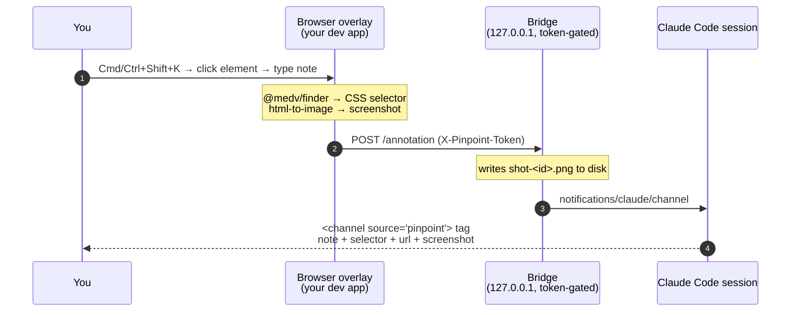

# pinpoint

> **Live in-browser UI annotation for Claude Code.** Click an element in your running
> dev app, type a note, hit send — and it streams straight into your active Claude Code
> session with a screenshot, the element's CSS selector, and the page URL attached.


## The problem

The usual "point Claude at some UI" loop is copy-paste drudgery: you screenshot the
browser, describe *where* the thing is in prose ("the second card in the pricing grid,
the one with the misaligned badge"), paste it into the terminal, and hope Claude can map
your words back onto the DOM. Every round trip loses context.

**pinpoint closes the loop.** You annotate *on the live page* — the element you clicked
*is* the reference. No manual screenshots, no "which button did you mean", no describing
coordinates. The note lands in Claude with the selector and a screenshot already attached,
so Claude knows exactly what you're looking at.

## How the loop works



The overlay is a tiny **dev-only** script injected into your app. It talks to a
localhost-only **bridge** (bundled as a stdio MCP server), which emits a Claude Code
**channel** event into your running session. v1 is one-way: browser → Claude.

## ⚠️ Requirements

> - **Claude Code v2.1.80 or newer.**
> - **Anthropic login** (the direct Anthropic API). Bedrock and Vertex are **not**
>   supported — channels are an Anthropic first-party feature.
> - **During the research preview you must launch Claude with the development-channels flag:**
>
>   ```
>   claude --dangerously-load-development-channels plugin:pinpoint@mrvnklm
>   ```
>
>   `/plugin install` registers the plugin and its MCP bridge, but it does **not** by
>   itself activate a custom channel — and a marketplace listing does **not** put the
>   channel on the Anthropic allowlist. Until pinpoint's channel is allowlisted, this flag
>   is the only way to load it. Without it, no pinpoint tags will ever arrive.

## Install & run

```
/plugin marketplace add mrvnklm/claude-plugins
/plugin install pinpoint@mrvnklm
```

Then **relaunch** Claude Code with the development-channels flag so the channel actually
activates:

```
claude --dangerously-load-development-channels plugin:pinpoint@mrvnklm
```

## Set up the overlay (dev-only)

The overlay ships as source and is built once:

```
npm install && npm run build
```

Then inject it **into your dev app in development only** — never in production. See
[`docs/injection.md`](docs/injection.md) for the framework-agnostic instructions (Vite and
plain-HTML snippets included).

For Nuxt, drop in a client plugin: copy
[`docs/nuxt-inject-template.ts`](docs/nuxt-inject-template.ts) to
`plugins/pinpoint.client.ts` and fill in the port and per-project token from
`.pinpoint/config.json` (written when the bridge first runs). The template's
`import.meta.dev` guard keeps it out of production builds.

> **Dev-only, always.** The overlay opens a channel to a localhost bridge and must never
> ship in a production bundle. Gate the injection behind your dev/prod flag.

## Usage

1. Open your dev app in the browser.
2. Click the floating pinpoint button, or press **Cmd/Ctrl + Shift + K**, to enter pick mode.
3. Hover and click the element you want to talk about — pinpoint highlights it and grabs
   its selector + a screenshot.
4. Type your note and send.
5. It shows up in your running Claude Code session, with the screenshot, CSS selector, and
   page URL attached.

## What Claude receives

Each annotation arrives inline as a `<channel source="pinpoint">` tag. The note you typed
is the tag body; everything else is an attribute:

```
<channel source="pinpoint"
         selector="body > main > button.save"
         url="http://localhost:3000/settings"
         title="Settings — Acme"
         id="1"
         viewport="1440x900"
         screenshot="/abs/project/.pinpoint/shot-1.png"
         source_hint="/src/SettingsForm.vue:42:7">Make this button green</channel>
```

| attribute     | what it is |
| ------------- | ---------- |
| *(body)*      | your note |
| `selector`    | a stable CSS selector for the clicked element ([@medv/finder](https://github.com/antonmedv/finder)) |
| `url`         | the page URL |
| `title`       | the page title |
| `id`          | per-annotation id (as a string) |
| `viewport`    | browser viewport size, e.g. `1440x900` |
| `screenshot`  | absolute path to a PNG on disk (may be absent if capture failed) |
| `source_hint` | a `file:line:col` hint from the nearest `[data-v-inspector]`, when present |

## Privacy & security

- **Localhost only.** The bridge binds to `127.0.0.1` — nothing is exposed on your network.
- **Token-gated.** `POST /annotation` requires a per-project token, stored in
  `.pinpoint/config.json` and sent by the overlay as the `X-Pinpoint-Token` header; a
  mismatch is rejected with `403`.
- **Nothing leaves the machine.** Screenshots and notes travel browser → localhost bridge →
  your local Claude Code session. No external service, no telemetry.

## How it works

pinpoint is built on **Claude Code Channels**. The bundled stdio MCP bridge
(`bridge/server.mjs`, registered via [`.mcp.json`](.mcp.json) using `${CLAUDE_PLUGIN_ROOT}`)
also runs a `127.0.0.1` HTTP listener. It serves the overlay at `GET /overlay.js`, answers
`GET /health` with `{ ok: true }`, and receives each annotation on `POST /annotation`. On
each annotation it writes the screenshot to disk and emits a `notifications/claude/channel`
event into your active session, which Claude Code surfaces inline as the `<channel>` tag
above. That custom channel is exactly what has to be loaded — hence the
`--dangerously-load-development-channels` flag during the preview.

## Roadmap (v2 — not yet built)

The following are planned and **not** implemented in v1:

- **Live status back into the overlay** — show *queued / working / done* on each annotation,
  via a reply tool plus a WebSocket from the bridge back to the browser.
- **Permission relay** — surface Claude Code permission prompts in the overlay so you can
  approve actions without switching back to the terminal.

## License

[MIT](../../LICENSE) © Marvin von Spreckelsen
